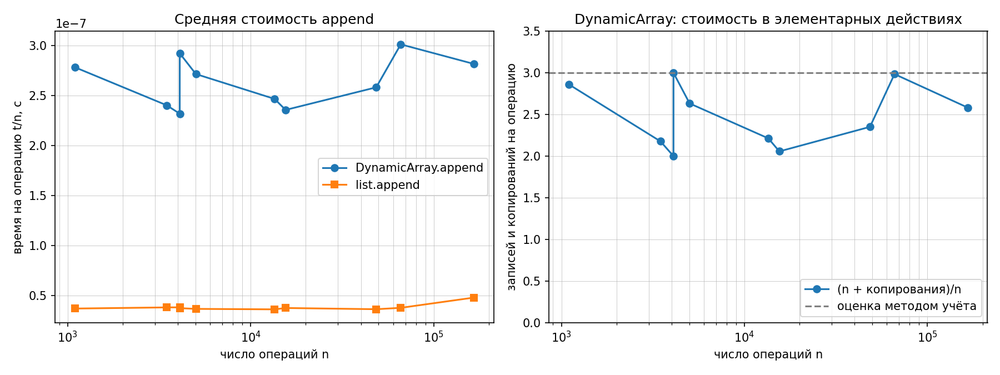
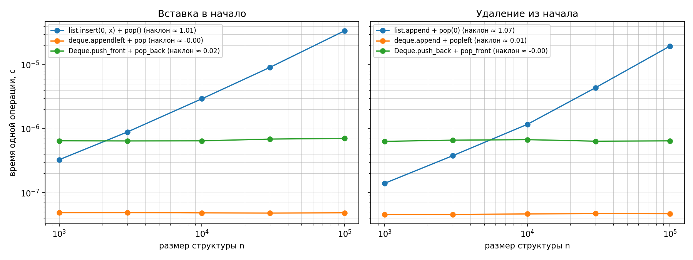

## МИНИСТЕРСТВО ЦИФРОВОГО РАЗВИТИЯ И МАССОВЫХ КОММУНИКАЦИЙ РОССИЙСКОЙ ФЕДЕРАЦИИ
## Ордена трудового Красного Знамени федеральное государственное бюджетное образовательное учреждение "Московский технический университет связи и информатики"

### Отчет по лабораторной работе №2: "Реализация рекурсивных функций и динамического массива, стека и дека"
### **Выполнил**: Студент группы БВТ-2502, Провкин Алексей Сергеевич
___

**Цель**: Освоить рекурсию как метод построения алгоритмов и реализовать базовые линейные структуры данных, подтвердив их асимптотические свойства (включая амортизированную сложность) экспериментально.

___
## Информация:
**Версия Python**: Python 3.10.11

**Процессор**: Intel(R) Core(TM) i5-10500H-CPU (базовая скорость: 2.5 GHz, максимальная скорость: 4.5 GHz)
___
### Ход выполнения работы:
1. Были сгенерированы данные по варианту 10
    ```bash
   (venv) PS C:\Users\Alexey\PycharmProjects\data-structures-and-algorithms> python scripts/generate_data.py --variant 10 --only ops
    Вариант 10 (seed=40), каталог C:\Users\Alexey\PycharmProjects\data-structures-and-algorithms\data\generated; создано файлов: 3
    C:\Users\Alexey\PycharmProjects\data-structures-and-algorithms\data\generated\ops_stack.txt
     C:\Users\Alexey\PycharmProjects\data-structures-and-algorithms\data\generated\ops_deque.txt
    C:\Users\Alexey\PycharmProjects\data-structures-and-algorithms\data\generated\ops_append_sizes.txt
    Паспорт данных: C:\Users\Alexey\PycharmProjects\data-structures-and-algorithms\data\generated\manifest.json

2. Реализован алгоритм `factorial`. Временная сложность: `O(n)`, так как выполняется `n` рекурсивных шагов, каждый из которых содержит `O(1)` операций.
3. Реализован алгоритм `fib_naive`. Временная сложность: `O(2^n)`, потому что с каждым рекурсивным шагом происходит ветвление на 2 новых рекурсивных шага `fib_naive(n - 1) + fib_naive(n - 2)`.
4. Реализован алгоритм `fib_memo`. Временная сложность: `O(n)`. 
```bash
n= 5  F(n)=     5  fib_naive:      15 вызовов  fib_memo:  9 вызовов
n=10  F(n)=    55  fib_naive:     177 вызовов  fib_memo: 19 вызовов
n=15  F(n)=   610  fib_naive:    1973 вызовов  fib_memo: 29 вызовов
n=20  F(n)=  6765  fib_naive:   21891 вызовов  fib_memo: 39 вызовов
n=25  F(n)= 75025  fib_naive:  242785 вызовов  fib_memo: 49 вызовов
n=30  F(n)=832040  fib_naive: 2692537 вызовов  fib_memo: 59 вызовов
```
В алгоритме с мемоизацией начиная с `n = 5` при возрастании `n` на `5` число вызовов линейно растет на `10`.
В алгоритме без мемоизации (наивная реализация) при возрастании `n` на `5` число вызовов растет примерно в 11 раз.
Это соответствует экспоненциальному росту. Это объясняется тем, что каждый неконцевой вызов порождает два рекурсивных вызова, а одинаковые подзадачи вычисляются многократно.

5. Реализован алгоритм Ханойских башен с подсчётом и записью перемещений (`hanoi`). 
6. Реализован класс `DynamicArray`, а также `Stack` и `Deque`.

## Анализ графиков вставки и удаления
При увеличении размера структуры время операций list.insert(0, x) и list.pop(0) возрастает приблизительно линейно: наклон log-log графика составляет 1.01 и 1.07 соответственно. Это связано с тем, что Python list реализован как динамический массив. При вставке или удалении первого элемента остальные элементы необходимо сдвигать, поэтому требуется выполнить до n операций.

Для collections.deque операции appendleft и popleft имеют практически нулевой наклон (около 0), что соответствует O(1). Собственный Deque показывает аналогичное поведение: push_front и pop_front имеют наклон около 0. Это связано с использованием двусвязного списка: для работы с началом дека достаточно изменить несколько ссылок и указатель head, независимо от количества элементов.

## Анализ графиков средней стоимости append и элементарных действий DynamicArray

Среднее время выполнения append у собственного DynamicArray выше, чем у стандартного list (примерно 2,7 с против 0,3 с для рассматриваемых серий). Это связано с константными затратами Python-реализации: собственный массив выполняет проверки, обращение к буферу и копирование элементов непосредственно на уровне Python, тогда как list реализован внутри CPython на C.

График `DynamicArray` имеет колебания при увеличении числа операций. Это связано с операциями увеличения ёмкости в два раза: большинство append выполняются за постоянное время, но при достижении границы ёмкости требуется создать новый буфер и скопировать существующие элементы. Благодаря удвоению ёмкости такие дорогостоящие операции происходят редко, поэтому средняя стоимость append остаётся амортизированно O(1).

## Почему (n + копирования) / n < 3

При увеличении размера `DynamicArray` его ёмкость каждый раз увеличивается в два раза. При этом при расширении необходимо скопировать все уже сохранённые элементы. Количество копирований образует геометрическую последовательность: `4 + 8 + 16 + ...`. Поэтому суммарное количество копирований за `n` операций меньше `2n`.

Величина `(n + копирования) / n` показывает среднее число записей и копирований, приходящихся на одну операцию `append`. Т.к. число копирований меньше `2n`, выполняется следующая оценка: `(n + копирования) / n < 3`.

Следовательно, несмотря на отдельные дорогие операции расширения массива, их доля среди всех операций уменьшается, и средняя стоимость одного `append` остаётся ограниченной константой. Поэтому `append` имеет амортизированную сложность `O(1)`.

___

## Постоянный множитель времени
Собственные структуры и стандартные `list` и `collections.deque` могут иметь одинаковую асимптотическую сложность, но различаться по фактическому времени выполнения. Это связано с постоянными накладными расходами реализации. Собственные структуры написаны на Python и выполняют дополнительные действия на уровне Python-интерпретатора, тогда как стандартные структуры реализованы внутри CPython на C и значительно оптимизированы. Поэтому стандартные структуры могут выполнять операции в несколько раз быстрее при сохранении той же асимптотической сложности.

___

## Число рекурсивных вызовов Фибоначчи (формула)

Для наивной рекурсивной реализации Fibonacci число вызовов описывается рекуррентной формулой

`C(n) = C(n-1) + C(n-2) + 1`.

Из-за повторного вычисления одних и тех же значений количество вызовов растёт экспоненциально и имеет сложность `O(2^n)`. Полученные экспериментальные значения подтверждают этот рост: при увеличении `n` с 5 до 30 число вызовов возрастает с 15 до 2 692 537.

Для реализации с мемоизацией уже вычисленные значения сохраняются в словаре. В используемой реализации число вызовов составляет `C(n) = 2n - 1`, поэтому имеет линейную сложность `O(n)`. Полученная таблица подтверждает формулу: для `n = 5, 10, 15, 20, 25, 30` получаем соответственно 9, 19, 29, 39, 49 и 59 вызовов.

___

## Проверка инвариантов

Была добавлена проверка собственных инвариантов:

```python
def check_invariants() -> None:
    """Собственные проверки инвариантов структур."""

    # DynamicArray
    arr = DynamicArray()
    for i in range(10):
        arr.append(i)

    expect(arr._size <= arr._capacity,
           "DynamicArray: size > capacity")
    expect(len(arr._buffer) == arr._capacity,
           "DynamicArray: размер buffer не равен capacity")

    # Deque
    dq = Deque()
    dq.push_back(1)
    dq.push_back(2)
    dq.push_front(0)

    expect(dq._head is not None and dq._tail is not None,
           "Deque: непустой дек имеет head и tail")
    expect(dq._head.prev is None,
           "Deque: head.prev != None")
    expect(dq._tail.next is None,
           "Deque: tail.next != None")
    expect(dq._head.next.prev is dq._head,
           "Deque: нарушена связь next/prev")
    expect(dq._tail.prev.next is dq._tail,
           "Deque: нарушена связь prev/next")

    count = 0
    node = dq._head
    while node is not None:
        count += 1
        node = node.next

    expect(count == dq._size,
           "Deque: количество узлов не совпадает с size")
```
___
## Графики:



___
## Использование ИИ
При выполнении лабораторной работы были использованы модели: 
- Claude Sonnet 5
- ChatGPT 5.6 Luna

Все платные модели были использованы в режиме `free plan`, при выполнении лабораторной работы не были использованы агенты. Генеративный ИИ использовался для консультации, проверки рассуждений, поиска ошибок в формулах и формулировки отдельных частей отчета. Реализация алгоритмов и итоговая проверка их работоспособности выполнялись самостоятельно.