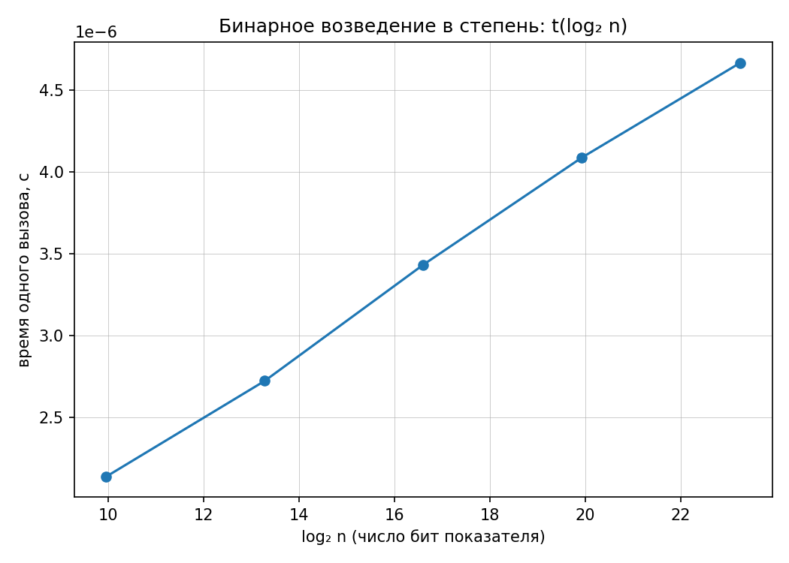
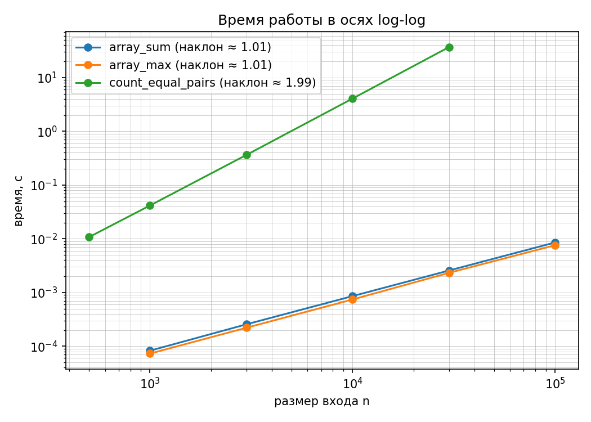

## МИНИСТЕРСТВО ЦИФРОВОГО РАЗВИТИЯ И МАССОВЫХ КОММУНИКАЦИЙ РОССИЙСКОЙ ФЕДЕРАЦИИ
## Ордена трудового Красного Знамени федеральное государственное бюджетное образовательное учреждение "Московский технический университет связи и информатики"

### Отчет по лабораторной работе №1: "Анализ временной сложности элементарных алгоритмов"
### **Выполнил**: Студент группы БВТ-2502, Провкин Алексей Сергеевич
___

**Цель**: Научиться определять временную сложность алгоритма аналитически и подтверждать оценку экспериментально.

___
## Информация:
**Версия Python**: Python 3.10.11

**Процессор**: Intel(R) Core(TM) i5-10500H-CPU (базовая скорость: 2.5 GHz, максимальная скорость: 4.5 GHz)
___
### Ход выполнения работы:
1. Настроено окружение (Python 3.10) и установлено все необходимое из requirements.txt:
```bash
pip install -r requirements.txt
```
2. Сгенерированы данные по варианту 10:
```bash
python scripts/generate_data.py --variant 10
```
3. Проанализировано содержимое заготовки `lab01-complexity-starter.py`.
4. Создан файл `draft.py` для написания четырех элементарных алгоритмов в рамках лабораторной работы: (а) сумма элементов массива; (б) поиск максимума; (в) подсчёт пар равных элементов (двойной цикл); (г) бинарное возведение в степень (с поддержкой вычислений по модулю).
5. Каждый из 4 алгоритмов был записан в `draft.py`
___
### 6. Анализ алгоритмов:
**Элементарная операция** - это самое простое действие в вычислительной технике или алгоритмах, которое нельзя разделить на более простые шаги в рамках заданного языка или системы.

**Количество элементарных операций** в алгоритме равно определенному выражению от `n` (где n - обычно размер входных данных), потому что время работы программы напрямую зависит от количества шагов, которые выполняет процессор для обработки этих данных.

**Математическое выражение**, связывающее `n` и число операций, называется функцией временной сложности алгоритма.

## Анализ первого алгоритма:

## Обоснование:
Производится оценка худшего случая посредством вывода T_worst(n) и последующего присваивания класса сложности (Big O или "Тета"). Рассмотрены элементарные операции вне цикла `for i in range(a_length)` и оценены в O(1). 
> Стоит отметить, что `isinstance` работает приблизительно на 50% медленнее, чем `type(a) is list`, потому что проверяет `a` на экземпляр подкласса. В случае, если `a` **является** экземпляром подкласса, Python по необходимости проходит по цепочке наследования (MRO). Таким образом операцию `isinstance` используют чаще, ведь она не ломает логику ООП и априори надежнее. К оптимизации через `type() is...` прибегают только в критических к производительности участках кода.

Далее рассматривается сам цикл. Это цикл от 0 до n-1, т.е. n раз, он оценивается в O(n). На каждой итерации цикла происходит 2 элементарных операции - оператор "если" и операция присваивания `arr_sum = arr_sum + a[i]`. Таким образом сложность блока с циклом - O(2n).  По итогу получается временная сложность алгоритма T_worst(n) = 6 + 2n, к которой можно присвоить класс временной сложности посредством упрощения O(n) или "тета" от n.
___
## Анализ второго алгоритма:


Анализ второго алгоритма проведен по похожему принципу. Единственное весомое отличие - цикл проходится не от 0 до n-1, а от 1 до n-1, то есть количество итераций теперь не n, а n-1.
___

## Анализ третьего алгоритма:


Суть в том, что количество итераций у цикла `for j in range(i+1, a_length)` уменьшается с увеличением значения i. Выходит (n-1) + (n - 2) + (n - 3) + ... + 3 + 2 + 1 операций. Суммарное число итераций внутреннего цикла равно (n−1) + (n−2) + ... + 1 = n(n−1)/2. Получается форма суммы арифметической прогрессии, описывающая сложность этого блока: 3n(n-1)/2. К сумме добавляется n, потому что происходит проверка `isinstance` по каждому из элементов списка `a` с индексом `i`.
___

## Анализ четвертого алгоритма:


Сложность O(log n), потому что с каждой итерацией `n` уменьшается вдвое `n//=2`. Точное число итераций в цикле `while n > 0` - `⌊log₂n⌋+1`, т.е. логарифм, который округляется до меньшего целого. Добавление `+1` можно пояснить следующим образом: ⌊log₂n⌋ считает деления, а цикл считает ещё и последнюю итерацию на n=1 перед тем как дойти до нуля.
___

### 7. Бенчмарк
Был проведен бенчмарк (прогрев, 5 повторов, медиана) и получены следующие результаты:

## Результаты бенчмарка:
```
array_sum:
  n=   1000  t=0.000082 c
  n=   3000  t=0.000256 c
  n=  10000  t=0.000855 c
  n=  30000  t=0.002569 c
  n= 100000  t=0.008523 c

array_max:
  n=   1000  t=0.000073 c
  n=   3000  t=0.000221 c
  n=  10000  t=0.000741 c
  n=  30000  t=0.002327 c
  n= 100000  t=0.007571 c

count_equal_pairs:
  n=    500  t=0.010734 c
  n=   1000  t=0.041613 c
  n=   3000  t=0.365217 c
  n=  10000  t=4.072181 c
  n=  30000  t=37.121745 c

binary_pow (по 20000 вызовов на точку, по модулю 1000000007):
  n=     1000  log2(n)= 10.0  t=0.000002137 c
  n=    10000  log2(n)= 13.3  t=0.000002722 c
  n=   100000  log2(n)= 16.6  t=0.000003432 c
  n=  1000000  log2(n)= 19.9  t=0.000004087 c
  n= 10000000  log2(n)= 23.3  t=0.000004667 c

Наклон в осях log-log (оценка показателя степени):
  array_sum            1.006
  array_max            1.011
  count_equal_pairs    1.991
```
___
## График бинарного возведения:


___
## График log-log


___

## Наклон графика и теоретическая оценка
```
Наклон в осях log-log (оценка показателя степени):
  array_sum            1.006
  array_max            1.011
  count_equal_pairs    1.991

```
Наклон практически полностью совпадает с теоретическими значениями (1,1 и 2 соответственно). Вероятно расхождения возникли из-за шума работы ОС, накладных расходов интерпретатора Python или фоновых процессов (запущенный Pycharm, Obsidian).

___
## Почему log-log неинформативен для O(log n)
Для логарифмического алгоритма log-log график неинформативен, поскольку он позволяет оценивать показатель степени в степенной зависимости T(n) ∼ n^p. Логарифмическая зависимость T(n) ∼ log n после логарифмирования даёт log(log n), которая не является линейной функцией и не имеет постоянного наклона.
___
## Почему замер проходит по модулю
Замер быстрого возведения в степень выполняется по модулю, чтобы ограничить размер промежуточных целых чисел. Python использует целые числа произвольной точности, поэтому без модуля последовательное возведение в квадрат приводит к росту размера чисел и, соответственно, стоимости арифметических операций. Это могло бы исказить измерение и смешать сложность алгоритма с затратами на обработку длинных чисел.
___
## Почему используется линейный график для `binary_pow`
Для binary_pow используется линейный график зависимости времени выполнения от log₂ n, поскольку теоретическая сложность алгоритма составляет Θ(log n). При такой зависимости время выполнения приблизительно пропорционально log₂ n, поэтому на графике T(log₂ n) ожидается линейная зависимость.
___
## Инварианты и сравнение с эталоном
В `lab01-complexity-starter.py` в функцию `self_check()` были добавлены инварианты и сравнение с эталоном

```python
    # в массиве из попарно различных элементов равных пар нет.
    assert count_equal_pairs([1, 2, 3, 4, 5]) == 0

    # для массива из n одинаковых элементов число пар равно n(n-1)/2.
    assert count_equal_pairs([7, 7, 7, 7]) == 6

    # добавление нулевого элемента не изменяет сумму.
    assert array_sum([1, 2, 3, 0]) == array_sum([1, 2, 3])

    # добавление элемента, меньшего текущего максимума, не изменяет максимум.
    assert array_max([5, 3, 2, 1]) == array_max([5, 3, 2, 1, 0])

    # сравнение с эталоном
    assert array_sum([1, 2, 3, 4, 5, 6, 7, 8]) == sum([1, 2, 3, 4, 5, 6, 7, 8])
    assert array_max([22, 28, 19, 0, 23, 827, 1]) == max([22, 28, 19, 0, 23, 827, 1])
    assert binary_pow(3, 10, mod=POW_MOD) == pow(3, 10, POW_MOD)
```
После запуска `lab01-complexity-starter.py` функция `self_check()` показала результат `self_check: OK`. Следовательно, все инварианты и сравнения с эталоном сработали.
___
## Выводы о применимости
1. Алгоритм `array_sum` - **принять**. Θ(n), линейная сложность, экспериментальный показатель 1.006 практически совпадает с теоретическим 1. Алгоритм выполняет один проход по массиву и хорошо масштабируется.
2. Алгоритм `array_max` - **принять**. Θ(n), экспериментальный показатель 1.011 близок к теоретическому 1. Один проход по массиву, дополнительных структур данных не требуется.
3. Алгоритм `count_equal_pairs` - **принять с доработкой**. Θ(n²), экспериментальный показатель 1.991 соответствует теоретическому 2. Для небольших массивов алгоритм применим, но при росте n квадратичное время становится существенным ограничением. Для больших данных желательно заменить полный перебор пар на более эффективный подход, например подсчёт частот элементов.
4. Алгоритм `binary_pow` - **принять**. Θ(log n) по числу итераций, что существенно лучше линейного последовательного возведения в степень. Алгоритм особенно эффективен при больших показателях степени.
___
## Использование ИИ
При выполнении лабораторной работы были использованы модели: 
- Claude Sonnet 5
- ChatGPT 5.6 Luna
- DeepSeek V4.1-Flash

Все платные модели были использованы в режиме `free plan`, при выполнении лабораторной работы не были использованы агенты. Генеративный ИИ использовался для консультации по вопросам анализа асимптотической сложности, проверки рассуждений, поиска ошибок в формулах и формулировки отдельных частей отчета. Реализация алгоритмов и итоговая проверка их работоспособности выполнялись самостоятельно.